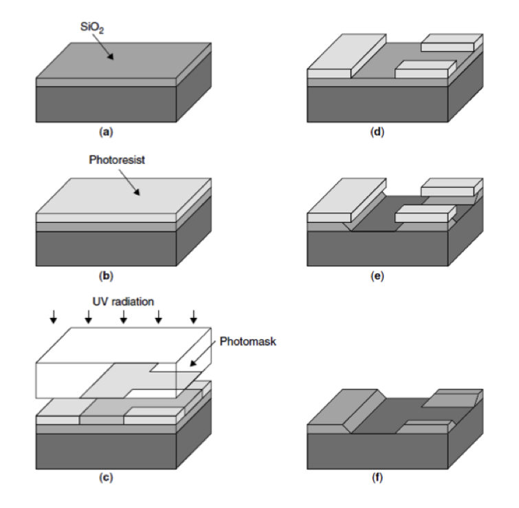
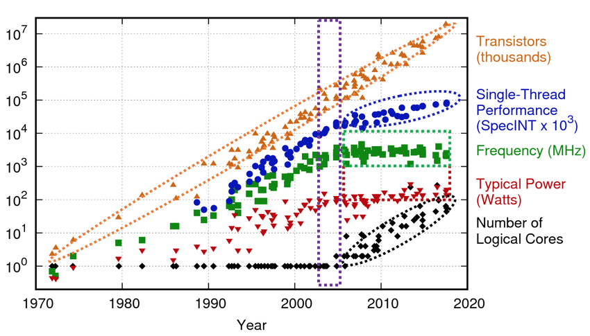
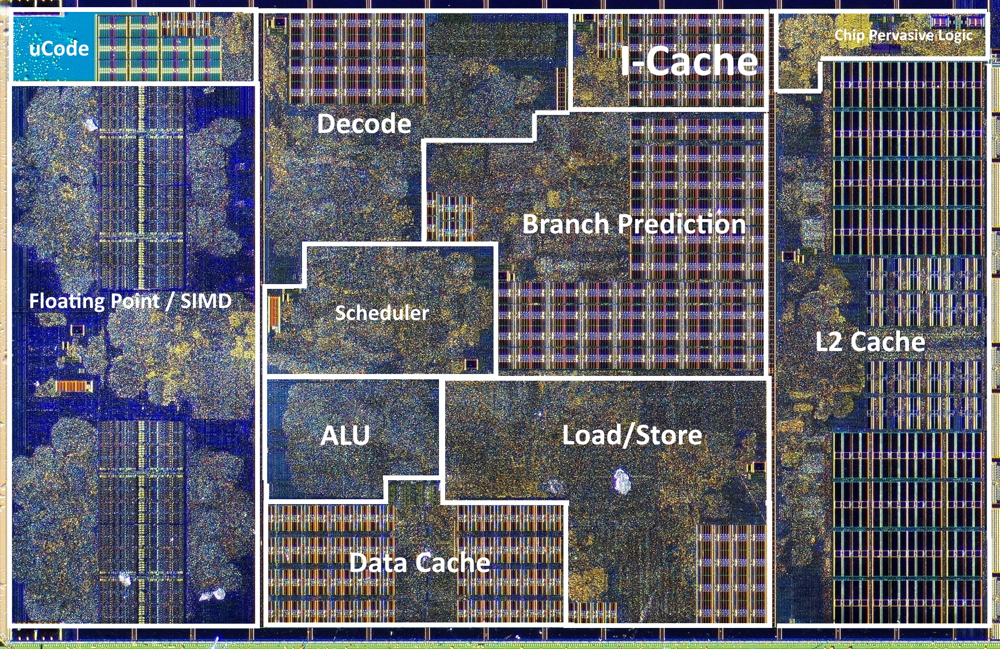

The main disadvantage of the supercomputers of the 1960s wasn't that they were slow — relatively speaking, they weren't — but that they were giant, complex to use, and so expensive that only the governments of the world superpowers could afford them. Their size was the reason they were so expensive: they required a lot of custom components that had to be very carefully assembled in the macro-world, by people holding advanced degrees in electrical engineering, in a process that couldn't be up-scaled for mass production.

The turning point was the development of *microchips* — single, tiny, complete circuits — which revolutionized the industry and turned out to be probably the most important invention of the 20th century. What was a multimillion-dollar cupboard of computing machinery in 1965 could in 1975 fit on a [4×4 mm slice of silicon](https://en.wikipedia.org/wiki/MOS_Technology_6502)[^size] that you can buy for $25. This dramatic improvement in affordability started the home computer revolution during the following decade, with computers like Apple II, Atari 2600, Commodore 64, and IBM PC becoming available to the masses.

[^size]: Actual sizes of CPUs are about centimeter-scale because of power management, heat dissipation, and the need to plug it into the motherboard without excessive swearing.

### How Microchips are Made

Microchips are "printed" on a slice of crystalline silicon using a process called [photolithography](https://en.wikipedia.org/wiki/Photolithography), which involves

1. growing and slicing a [very pure silicon crystal](https://en.wikipedia.org/wiki/Wafer_(electronics)),
2. covering it with a layer of [a substance that dissolves when photons hit it](https://en.wikipedia.org/wiki/Photoresist),
3. hitting it with photons in a set pattern,
4. chemically [etching](https://en.wikipedia.org/wiki/Etching_(microfabrication)) the now exposed parts,
5. removing the remaining photoresist,

…and then performing another 40-50 steps over several months to complete the rest of the CPU.

Consider now the "hit it with photons" part. For that, we can use a system of lenses that projects a pattern onto a much smaller area, effectively making a tiny circuit with all the desired properties. This way, the optics of the 1970s were able to fit a few thousand transistors on the size of a fingernail, which gives microchips several key advantages that macro-world computers didn't have:

- higher clock rates (that were previously limited by the speed of light);
- ability to scale the production;
- much lower material and power usage, translating to much lower cost per unit.

Apart from these immediate benefits, photolithography enabled a clear path to improve performance further: you can just make lenses stronger, which in turn would create smaller, but functionally identical devices with relatively little effort.

### Dennard Scaling

Consider what happens when we scale a microchip down. A smaller circuit requires proportionally fewer materials, and smaller transistors take less time to switch (along with all other physical processes in the chip), allowing reducing the voltage and increasing the clock rate.

A more detailed observation, known as the *Dennard scaling*, states that reducing transistor dimensions by 30%

- doubles the transistor density ($0.7^2 \approx 0.5$),
- increases the clock speed by 40% ($\frac{1}{0.7} \approx 1.4$),
- and leaves the overall *power density* the same.

Since the per-unit manufacturing cost is a function of area, and the exploitation cost is mostly the cost of power[^power], each new "generation" should have roughly the same total cost, but 40% higher clock and twice as many transistors, which can be promptly used, for example, to add new instructions or increase the word size — to keep up with the same miniaturization happening in memory microchips.

[^power]: The cost of electricity for running a busy server for 2-3 years roughly equals the cost of making the chip itself.

Due to the trade-offs between energy and performance you can make during the design, the fidelity of the fabrication process itself, such as "180nm" or "65nm", directly translating to the density of transistors, became the trademark for CPU efficiency[^fidelity].

[^fidelity]: At some point, when Moore's law started to slow down, chip makers stopped delineating their chips by the size of their components — and it is now more like a marketing term. [A special committee](https://en.wikipedia.org/wiki/International_Technology_Roadmap_for_Semiconductors) has a meeting every two years where they take the previous node name, divide it by the square root of two, round to the nearest integer, declare the result to be the new node name, and then drink lots of wine. The "nm" doesn't mean nanometer anymore.

Throughout most of the computing history, optical shrinking was the main driving force behind performance improvements. Gordon Moore, the former CEO of Intel, predicted in 1975 that the transistor count in microprocessors will double every two years. His prediction held to this day and became known as *Moore's law*.

Both Dennard scaling and Moore's law are not actual laws of physics, but just observations made by savvy engineers. They are both destined to stop at some point due to fundamental physical limitations, the ultimate one being the size of silicon atoms. In fact, Dennard scaling already did — due to power issues.

Thermodynamically, a computer is just a very efficient device for converting electrical power into heat. This heat eventually needs to be removed, and there are physical limits to how much power you can dissipate from a millimeter-scale crystal. Computer engineers, aiming to maximize performance, essentially just choose the maximum possible clock rate so that the overall power consumption stays the same. If transistors become smaller, they have less capacity, meaning less required voltage to flip them, which in turn allows increasing the clock rate.

Around 2005–2007, this strategy stopped working because of *leakage* effects: the circuit features became so small that their magnetic fields started to make the electrons in the neighboring circuitry move in directions they are not supposed to, causing unnecessary heating and occasional bit flipping.

The only way to mitigate this is to increase voltage; and to balance off power consumption you need to reduce clock frequency, which in turn makes the whole process progressively less profitable as transistor density increases. At some point, clock rates could no longer be increased by scaling, and the miniaturization trend started to slow down.

<!--

### Power Efficiency

It may come as a surprise, but the primary metric for modern CPUs is not the clock frequency, but rather "useful operations per joule", or, more practically put, "useful operations per dollar".

Thermodynamically, a computer is just a very efficient device for converting electrical power into heat. This heat eventually needs to be removed, and it's not straightforward to do when you are working with a millimeter-scale crystal. There are physical limits of how much power you can consume and then dissipate.

Historically, the three main variables guiding microchip designs are power, performance and area (PPA), commonly defined in watts, hertz and nanometers. Until ~2005, cost, which was mainly a function of area, and performance, used to be the most important criteria. But as battery-driven mobile devices started replacing PCs, power quickly and firmly moved up on top of the list, followed by cost and performance.

Leakage: interfering magnetic fields make electrons move in the directions they are not supposed to and cause unnecessary heating. It isn't bad by itself: it mitigate it you need to increase the voltage, and it won't flick any bits. But the problem is that the smaller a circuit is, the harder it is to cope with this by isolating the wires. So modern chips keep the clock frequency at a level that won't cause overheat, although physically there aren't other reasons why they shouldn't.

-->

### Modern Computing

Dennard scaling has ended, but Moore's law is not dead yet.

Clock rates plateaued, but the transistor count is still increasing, allowing for the creation of new, *parallel* hardware. Instead of chasing faster cycles, CPU designs started to focus on getting more useful things done in a single cycle. Instead of getting smaller, transistors have been changing shape.

This resulted in increasingly complex architectures capable of doing dozens, hundreds, or even  thousands of different things every cycle.

Here are some core approaches making use of more available transistors that are driving recent computer designs:

- Overlapping the execution of instructions so that different parts of the CPU are kept busy (pipelining);
- Executing operations without necessarily waiting for the previous ones to complete (speculative and out-of-order execution);
- Adding multiple execution units to process independent operations simultaneously (superscalar processors);
- Increasing the machine word size, to the point of adding instructions capable of executing the same operation on a block of 128, 256, or 512 bits of data split into groups ([SIMD](/hpc/simd/));
- Adding [layers of cache](/hpc/cpu-cache/) on the chip to speed up [RAM and external memory](/hpc/external-memory/) access time (memory doesn't quite follow the laws of silicon scaling);
- Adding multiple identical cores on a chip (parallel computing, GPUs);
- Using multiple chips in a motherboard and multiple cheaper computers in a data center (distributed computing);
- Using custom hardware to solve a specific problem with better chip utilization (ASICs, FPGAs).

For modern computers, the "[let's count all operations](../)" approach for predicting algorithm performance isn't just slightly wrong but is off by several orders of magnitude. This calls for new computation models and other ways of assessing algorithm performance.
