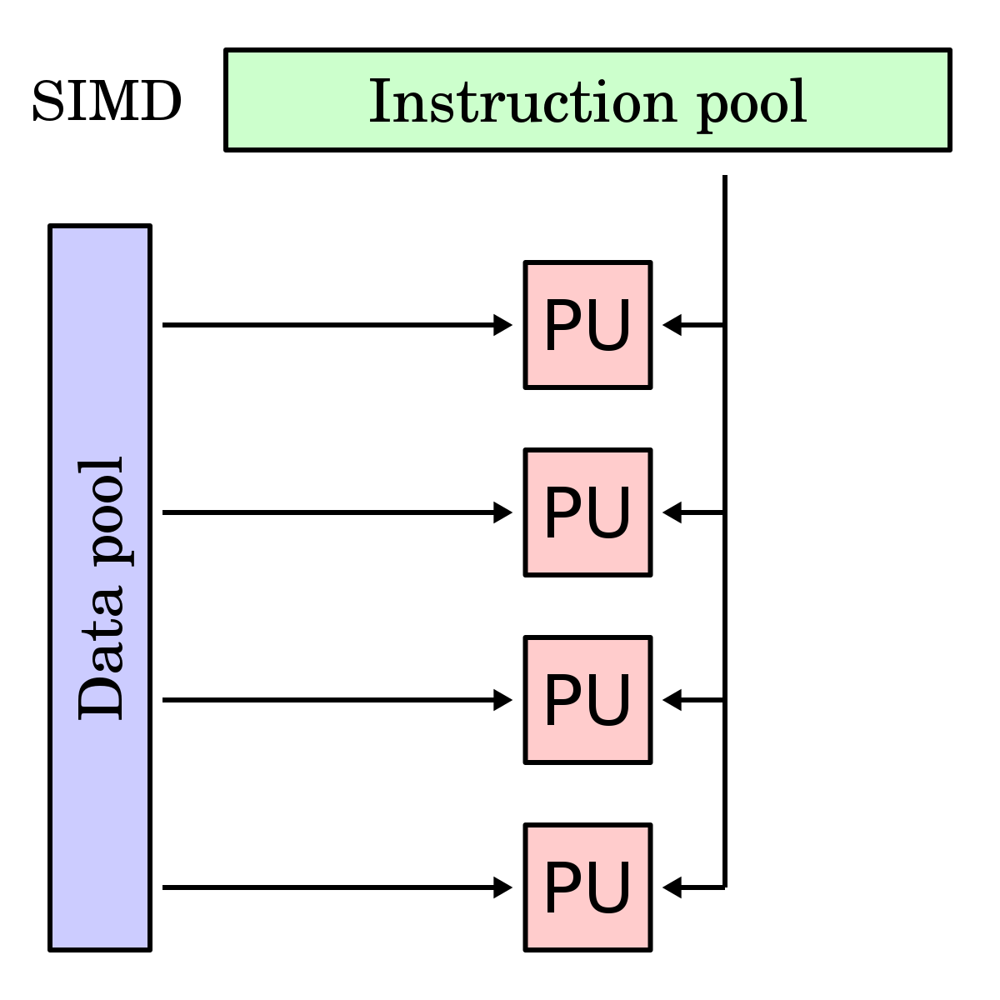
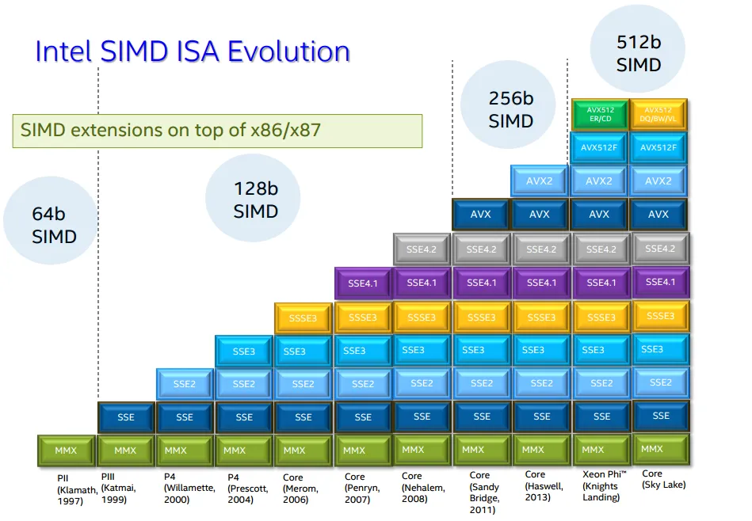

Consider the following little program, in which we calculate the sum of an integer array:

```c++
const int n = 1e5;
int a[n], s = 0;

int main() {
    for (int t = 0; t < 100000; t++)
        for (int i = 0; i < n; i++)
            s += a[i];

    return 0;
}
```

If we compile it with plain `g++ -O3` and run, it finishes in 2.43 seconds.

Now, let's add the following magic directive in the very beginning:

```c++
#pragma GCC target("avx2")
// ...the rest is the same as before
```

Compiled and run in the exact same environment, it now finishes in 1.24 seconds. This is almost twice as fast, and we didn't change a single line of code or the optimization level.

What happened here is we provided a little bit of info about the computer on which this code is supposed to be run. Specifically, we told the compiler that the target CPU supports an extension to x86 instruction set called "AVX2". AVX2 is one of the many so-called "SIMD extensions" for x86. These extensions include instructions that operate on special registers capable of holding 128, 256, or even 512 bits of data using the "single instruction, multiple data" (SIMD) approach. Instead of working with a single scalar value, SIMD instructions divide the data in registers into blocks of 8, 16, 32, or 64 bits and perform the same operation on them in parallel, yielding a proportional increase in performance[^power].

[^power]: On some CPUs, especially heavy SIMD instructions consume more energy and thus [require downclocking](https://blog.cloudflare.com/on-the-dangers-of-intels-frequency-scaling/) in order to balance off the total power consumption, so the real time speedup is not always proportional.



These extensions are relatively new, and their support in CPUs has been implemented gradually while maintaining backwards compatibility[^avx512]. Apart from adding more specialized instructions, the most important difference between them is the introduction of progressively wider registers.

In particular, AVX2 has instructions for working with 256-bit registers, while by default GCC assumes that nothing past the 128-bit SSE2 is enabled. Hence, after telling the optimizer that it can use instructions that add 8 integers at once instead of 4, the performance was increased twofold.

[^avx512]: Starting with AVX512, backwards compatibility is no longer maintained: there are many different "flavours" tailored to specific needs such as data compression, encryption or machine learning.



Compilers often do a good job rewriting simple loops with SIMD instructions, like in the case above. This optimization is called *autovectorization*, and it is the preferred way to use SIMD.

The problem is, it only works with certain types of loops, and even then it often yields suboptimal results. To understand its limitations, we need to get our hands dirty and explore this technology on a lower level, which is what we will do in this chapter.
