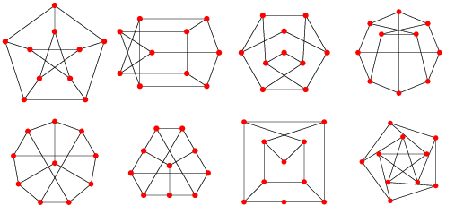

**Определение.** *Графом* называется пара множеств $G = (V, E)$, где множество $V$ называется множеством *вершин* графа, а множество $E$, состоящее из пар вершин $(u, v)$, называется множеством *ребер* графа.

Если существует ребро $(u, v)$, то говорят что оно *соединяет* вершины $u$ и $v$. Две вершины, соединенные ребром, называют *смежными*. Для вершины $v$ любое ребро $(v, u)$ называется *инцидентным* ей. Число ребер, инцедентных вершине $v$, называют *степенью* вершины $v$.

Если какие-то две вершины соединены более, чем одним ребром, то говорят, что граф содержит *кратное* ребро. Если ребро соединяет вершину саму с собой, то такое ребро называют *петлей*. Если граф не содержит петель и кратных ребер, то он называется *простым*.

Граф называют *ориентированным*, если для каждого ребра задано направление, и неориентированным в противном случае. Для ребра $(u, v)$ *обратным* ребром называется ребро $(v, u)$. Неориентированные графы часто рассматривают как ориентированные, добавив вместо каждого ребра два для каждого направления.

*Путем* называется последовательность вершин, соединенных между собой ребрами. Если в пути не повторяются вершины, он называется *простым*. Из вершины $v$ *достижима* вершина $u$, если существует путь, начинающийся в $v$ и заканчивающийся в $u$. Если от каждой вершины достижима любая другая, граф называется *связным*.

*Циклом* называется путь, начинающийся и заканчивающийся в одной и той же вершине. Если помимо первой и последней вершины все остальные вершины на этой пути уникальны, то такой цикл называется *простым*. Граф называют *ацикличным*, если в нем нет простых циклов.

Ацикличный неориентированный граф называется *лесом*. Связный лес называется *деревом*. У деревьев есть другие эквивалентные определения:

- Граф является деревом, если в нем $n$ вершин и $(n-1)$ ребер и нет циклов.
- Граф является деревом, если из любой вершины можно дойти в любую другую единственным образом.

Если дерево называется *корневым*, если у него есть ровно одна специальная вершина, называемая *корнем*. Часто подразумневается, что ребра корневого дерева ориентированы так, что от корня можно дойти от всех остальных вершин.

Граф называется *планарным*, если его можно разложить на плоскости так, чтобы его ребра не пересекались в точках, отличных от вершин. Граф называется *двудольным*, если его вершины которого можно разделить на два множества таких, что ребра соединяют только вершины из разных множеств.

### Англо-русский графовый словарь

- граф — *graph*
- вершина — *vertex*
- вершины — *vertices*
- ребро — *edge*
- смежный — *adjacent*
- степень — *degree*
- петля — *self-loop*
- ориентированный граф — *directed graph*
- неориентированный граф — *undirected graph*
- цикл — *cycle*
- ацикличный граф — *acyclic graph*
- дерево — *tree*
- планарный граф — *planar graph*
- двудольный граф — *bipartite graph*

В теории графов есть [много других важных понятий](https://en.wikipedia.org/wiki/Glossary_of_graph_theory), до которых мы дойдем позже, когда они понадобятся.
