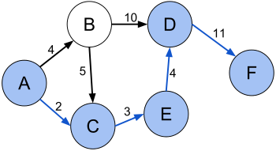

**Определение.** *Кратчайшим путем* между вершинами $a$ и $b$ в неориентированном графе называется путь между ними, содержащий наименьшее количество ребер.

В зависимости от контекста, под *длиной пути* может иметься в виду как число ребер ($k$), число промежуточных вершин ($k-1$), так и суммарное число вершин ($k+1$), включая начало и конец.

Кратчайший путь между парой вершин не всегда уникален.

**Определение.** *Взвешенным графом* называется граф, в котором каждому ребру сопоставляется число, называемое *весом*, *длиной* или *стомостью*.

Во взвешенных графах длиной пути называется суммарная длина всех его ребер.

Если не сказано обратного, длина ребра может быть любым числом — в том числе отрицательным. В графах с отрицательными ребрами может возникнуть контринтуитивная ситуация, когда есть *цикл* отрицательного веса, по которому можно ходить бесконечно и таким образом получить путь произвольного малого веса между двумя вершинами, в промежутке проходя много раз по этому циклу. Поэтому обычно рассматривают графы с неотрицательными длинами ребер.

Часто требуется искать кратчайшие пути в графах. Эта задача имеет несколько тесно связанных вариаций:

- Нахождение кратчайшего пути между заданной парой вершин $a$ и $b$.
- Нахождение кратчайших путей между заданной вершиной $a$ и всеми остальными вершинами в графе.
- Нахождение кратчайших путей между каждой парой вершин в графе.

В этой главе мы рассмотрим несколько классических алгоритмов для решения этой и других смежных задач.
